# xMatters Splunk integration with Custom Message Properties

Love Splunk and xMatters but tired of just getting a message saying that something is wrong missing the crucial piece of information that you need to make a decision **?**

Configured loads of field extracts that look just fantastic in Splunk but frustrated you have to go into Splunk to see the current values for them**??**

Want to use Splunk fields values from in onward tool chaining**???**

Then you need custom message properties on your Splunk integration to xMatters to allow you to specify any message you like in the Splunk Alert config including field values and have them come right through to xMatters events, notifications and integrations.

Turn your alert config from just 2 boring properties ...
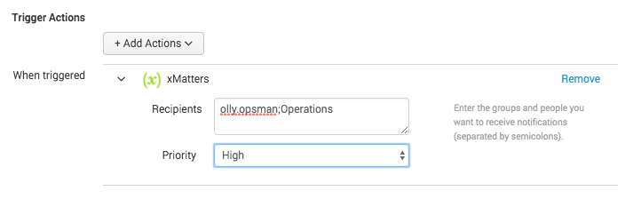
... into a mind blowing 4!
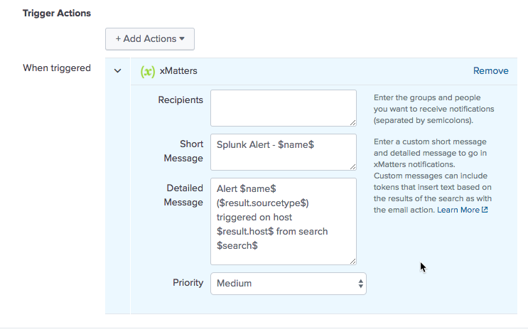

Turn your boring old messages into something meaningful!!


# Pre-Requisites
* Splunk Enterprise
* xMatters account - If you don't have one, [get one](https://www.xmatters.com)!

# Files
* [xmatters_alert_action](xmatters_alert_action) - This is the entire Splunk integrtion for xMatters with modified files.  You don't really need all of it though, you'll be interested in:
* [.../bin/xmatters.py](xmatters_alert_action/bin/xmatters.py)
* [.../README/alert_actions.conf.spec](xmatters_alert_action/README/alert_actions.conf.spec)
* [.../default/alert_actions.conf](xmatters_alert_action/default/alert_actions.conf)
* [.../default/data/ui/alerts/xmatters.html](xmatters_alert_action/default/data/ui/alerts/xmatters.html)


# How it works
Add some info here detailing the overall architecture and how the integration works. The more information you can add, the more helpful this sections becomes. For example: An action happens in Application XYZ which triggers the thingamajig to fire a REST API call to the xMatters inbound integration on the imported communication plan. The integration script then parses out the payload and builds an event and passes that to xMatters.

# Installation Instructions

## 1. Setup the standard Splunk to xMatters Integration
This is all about making the existing supported built in integration a little better. So you have to have set up that integration first.  If you're currently using an older integration, a web hook or your own built integration go install the latest integration in parallel and go from there.

Head to the integration directory in xMatters instance and find the Splunk integration.  Follow the instructions to set it up in xMatters and in Splunk.  You'll also be directed to the [online instructions page for the integration](https://help.xmatters.com/integrations/logmgmt/splunk.htm?cshid=SPLUNK).


(At the time of writing this and testing this integration the Splunk 'App' for xMatters was version 1.3.1)

## 2. Update the integration in Splunk
Now you should be able to go to create a new alert with an xMatters action.  The configuration screen in xMatters will give you only 2 configuables, who and what priority.  Let's improve on that!


You're going to need to get access to your Splunk server, and know where Splunk has been installed on it.  On my server Splunk was installed in `/opt/splunk`.

Navigate to where that applications are installed in Splunk, this should be `etc/apps` within the Splunk install.  Here you will see the directory `xmatters_alert_action`, this is the xMatters application for Splunk. You can either copy `xmatters_alert_action` from this repo over the top, or just copy these 4 files from the repo over the top of the files on your server with the same names.

```
xmatters_alert_action/bin/xmatters.py
xmatters_alert_action/README/alert_actions.conf.spec
xmatters_alert_action/default/alert_actions.conf
xmatters_alert_action/default/data/ui/alerts/xmatters.html
```

At this point it's a good idea to restart Splunk, but it doesn't seem to be essential.

Ok, now check out your creating an Alert in Splunk and adding the xMatters action again.  You should see a couple of extra boxes to define a Short Message and a Detailed Message.  Each of these can take the same Splunk tokens you can use in the email action and there's a link to the help page on that as well as some examples already populated for you.  If you have some custom fields for the Splunk event you can put them right in these messages with something like `$result.my_favroute_field_name$`.


## 3. Update the integration in xMatters
Ok great, so now you're sending in a couple more properties to xMatters.  But xMatters doesn't know what to do with them yet so let's go tell it.

You're going to need to convert the built in integration into a Communication Plan that you can edit. There's more about this under **Convert to communication plan** on the [Integration Directory help page](https://help.xmatters.com/ondemand/xmodwelcome/integrationdirectory/integration-directory.htm?cshid=IntegrationManagerPlace).  Converting an integration is not a reversible process.  To convert simply find the integration on the configured integrations page and choose *Convert to Communication Plan*

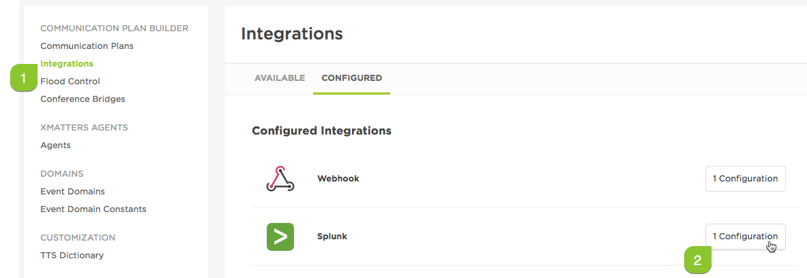

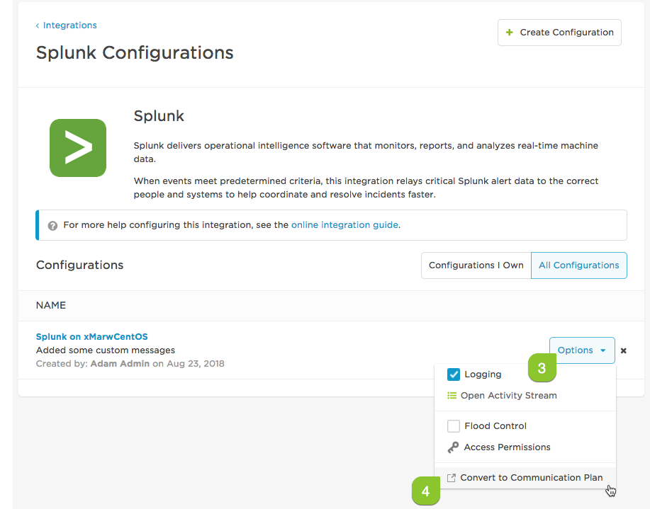

Read and then accept the warning.  You'll be delivered into the newly created Communication Plan.

Go into the layout editor on the Alert form.

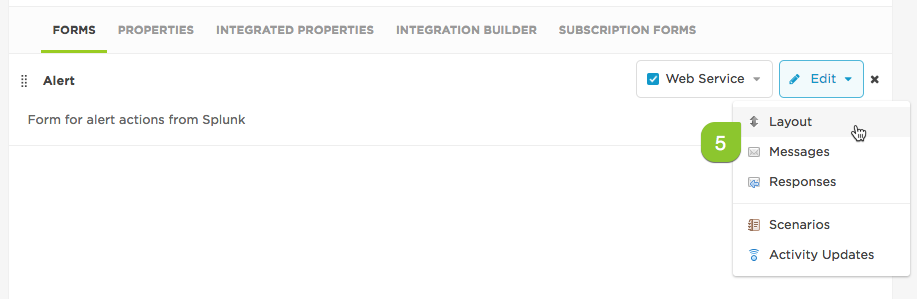

Add two new **text** properties to the from (I used max length 20000). New properties must be named `custom_short_message` and `custom_detail_message` exactly.

Ensure you pull the new properties on to the from and save it. They can go anywhere on the form.

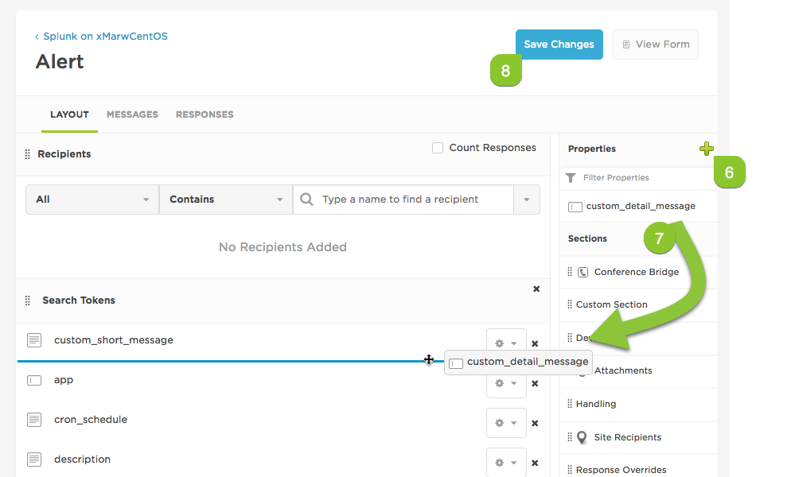

Great, you now have 2 new properties for your custom messages to go into. Any new events that come on to xMatters from the Splunk alert will have these properties populated with your text and you'll be able to see it on the properties tab of the event.  If you want to get these into the notifications that are sent out though read on...

## 4. Update the notifications to have the new messages.

If you're still editing the form layout simply click on to the messages sub tab.

If you've navigated away to test you're new properties then you can find it again on the Developer tab in the *Communication Plans* section. Click Edit -> Forms, and then on the Alert form Edit -> Messages

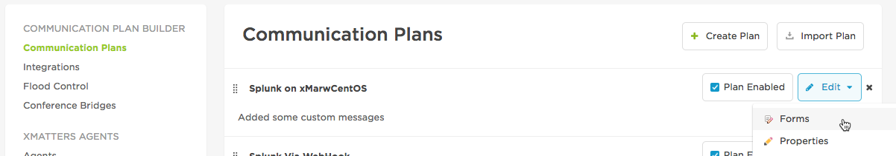

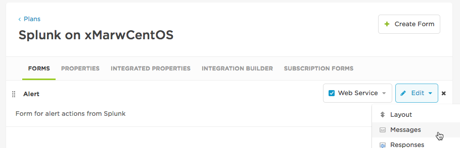

Edit the Email, Test Message and Voice Interaction templates in turn.

Get your art on and put your new message content somewhere it will have the maximum impact!

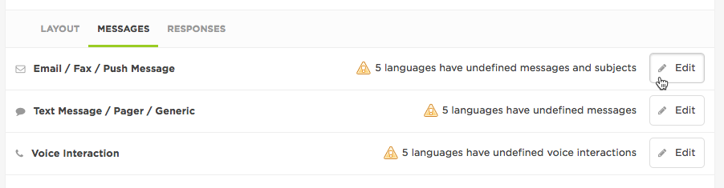

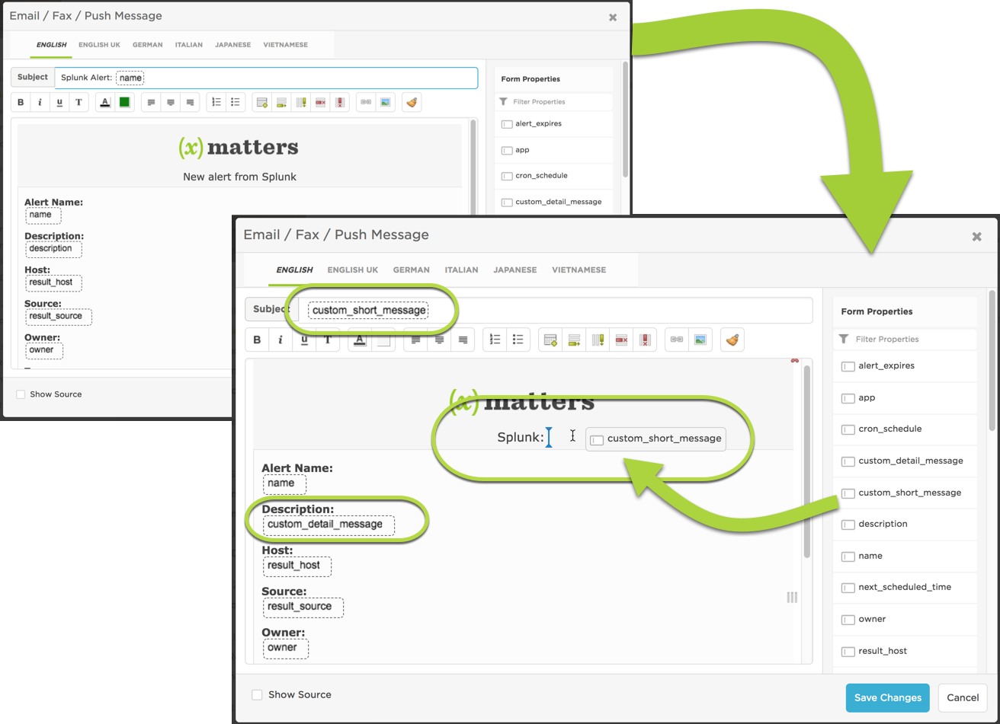


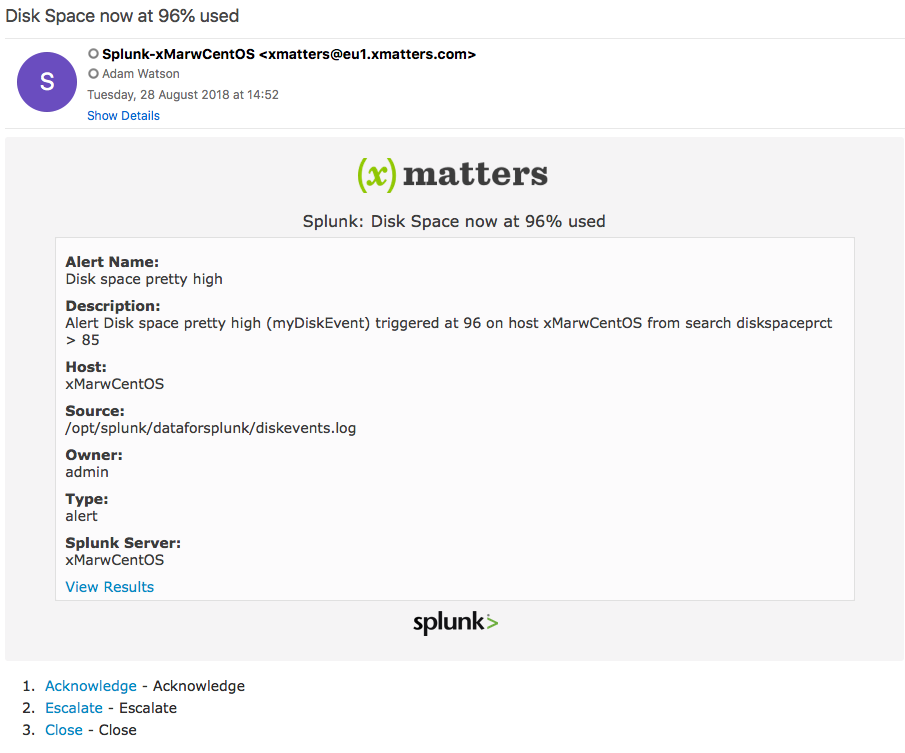

## 5. You're done! Now configure your Alerts!!
Great, now you can go create loads of Alerts in Splunk that use the new custom message properties!  For each alert you can configure the message properties to have different text and use different field values relevant to that Alert.

In the example from the end of the last section I used a search on a custom field extraction I created in Splunk.  The extracted filed is called *diskspaceprct* so I'm able to put it in the new custom messages on the alert configuration by specifying it as `$result.diskspaceprct$`

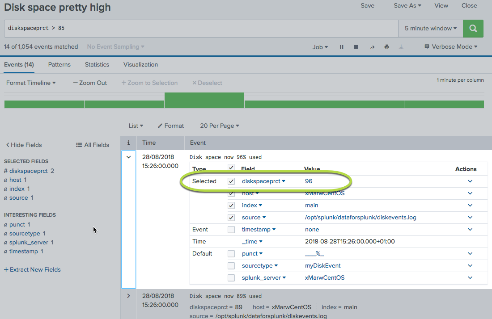

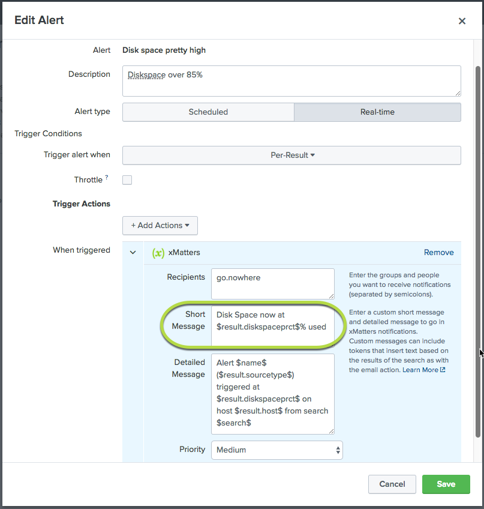


Tada!

***
*Originally by Adam Watson - Owned by xMatters - See licence file*
